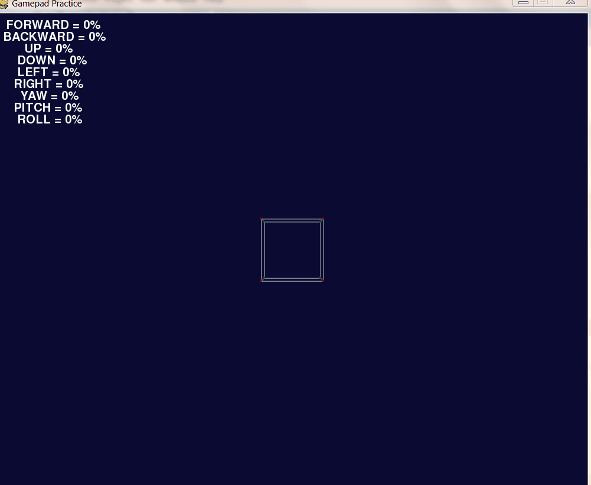

# Cube Movement in 3D Space

>Code based on Peter Collingridge's work:
>- [PyGame 3D Geometry](https://github.com/petercollingridge/code-for-blog/tree/master/pygame-3D)
>- [General Tutorials](https://www.petercollingridge.co.uk/tutorials/)

Code that works with my USB XBox controller that moves a wireframe cube through 3D space.
\
\
